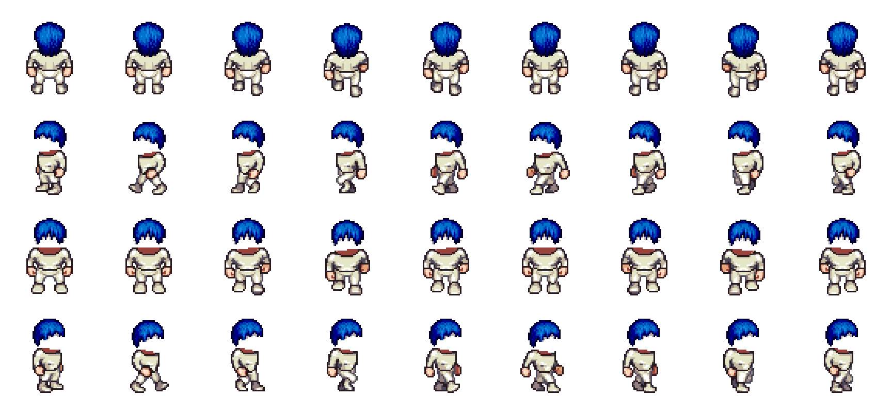

# 「大模型世界」像素角色自动生成管线调研

> 调研日期：2026-08-31
> 方法：全部结论基于当日实际访问的仓库 / npm registry / 许可证原文，并在本机做了可复现实测（分层合成、调色板换色、字体子集化、包体积测量）。不依赖记忆。文末列出全部证据 URL。

---

## 0. 一句话结论

**不要走 AI 生图，走「LPC 分层素材 + 确定性哈希选层 + 离线合成」。**

理由：AI 生图每次新模型都要联网付费、风格会漂移、失败需要重试，和「零维护全自动」直接冲突；而 LPC 提供了 657 个机器可读的图层定义、22 个调色板定义、64×64 标准网格的 4 向行走图，我实测把 5 个图层合成一张 576×256 的完整行走 spritesheet 只需 **约 50 ms、产出 18 KB PNG、全程不联网、零成本**，并且同一输入永远产出同一结果。AI 生图只作为「个别旗舰模型手工出图」的可选补充，产物提交进仓库，不进关键路径。

---

## 1. a16z-infra/ai-town 的美术资产管线

### 实际结构

| 项 | 实测结果 |
|---|---|
| 角色贴图 | `public/assets/32x32folk.png`，**384×256 px，179,178 字节**，即 12×8 个 32px 格子 |
| 角色数量 | `data/characters.ts` 里 8 个角色（`f1`–`f8`），**全部指向同一张 PNG**，只靠 frame 偏移区分 |
| 每角色布局 | 3 帧 × 4 方向 = 96×128 px，一张图放 4×2 = 8 个角色 |
| 帧数据 | `data/spritesheets/f1.ts` 等 13 个手写 TS 文件，内容是 PixiJS 的 `ISpritesheetData`：`frames.{down,down2,down3,left,...}` + `animations.{down:[...],left:[...]}` + `meta.scale` |
| 渲染 | `src/components/Character.tsx`：`BaseTexture.from(url, { scaleMode: NEAREST })` → `new Spritesheet(...)` → `@pixi/react` 的 `<AnimatedSprite textures={sheet.animations[direction]} isPlaying anchor={{x:.5,y:.5}} />` |
| 版本 | `pixi.js ^7.2.4` / `@pixi/react ^7.1.0` / React 18.2 —— **是 Pixi v7，不是 v8**（最新 `@pixi/react` 8.0.5 要求 pixi.js ^8.2.6 且 React ≥19） |
| 字体 | `public/assets/fonts/upheaval_pro.ttf`（294 KB）、`vcr_osd_mono.ttf`（74 KB），纯英文像素字体 |

### 素材来源与许可（重要坑）

仓库根 LICENSE 是 MIT（**只覆盖代码**）。README 的美术署名是**聚合式**的，没有逐文件映射：

- 图块：OpenGameArt 的 George Bailey「16x16 game assets」、hilau「16x16 rpg tileset」
- 「Original assets by ansimuz」
- UI 基于 Mounir Tohami 的原始素材
- **`32x32folk.png` 本身没有任何单独署名**——它只随根 MIT 一起分发

已经有第三方 fork（StevenWang-CY/township）把这件事写进了 `THIRD_PARTY_NOTICES.md`，明确记录这是一个「provenance limitation（来源无法确证）」，只能依赖根 MIT 来再分发。

> **给我们的启示**：直接搬 ai-town 的角色图，法律链条是断的。我们自己的素材必须逐文件带 license 元数据——LPC 恰好就是这么做的。

### 是否可分层换装

**不可以。** 一张扁平 atlas，帧表手写，改一个角色要人去 Aseprite 里画，然后手写一个 `.ts`。**ai-town 完全没有程序化生成角色的能力**，这正是我们要补的部分。

### ai-town 用的是哪个 AI 方案

README 的 Other credits 里写着 `Pixel Art Generation: Replicate, Fal.ai`。但我把仓库翻完了：**代码里没有任何角色生成逻辑**。作者是离线用 Replicate/fal.ai 生成了素材再手工整理进仓库的。仓库里真正自动化的 AI 调用只有背景音乐——`convex/music.ts` + `convex/crons.ts` 用 Replicate 的 MusicGen 定时生成，靠 webhook 回调。

---

## 2. 可程序化分层合成的开源像素素材

### 2.1 Universal LPC Spritesheet Character Generator —— 唯一真正可用的选项

仓库：`LiberatedPixelCup/Universal-LPC-Spritesheet-Character-Generator`，1,687 stars，**最后推送 2026-08-29（活跃维护）**，代码 GPL-3.0。

**机器可读的图层清单：有，而且质量很高。**

`sheet_definitions/` 共 **768 个 JSON**（657 个物件定义 + 111 个 meta），分 10 个类目目录：`arms / body / feet / hair / head / headwear / legs / tools / torso / weapons`。实测 `sheet_definitions/body/body.json` 的结构：

```json
{
  "name": "Body Color",
  "priority": 10,
  "layer_1": {
    "zPos": 10,
    "male": "body/bodies/male/",
    "muscular": "body/bodies/muscular/",
    "female": "body/bodies/female/",
    "pregnant": "body/bodies/pregnant/",
    "teen": "body/bodies/teen/",
    "child": "body/bodies/child/"
  },
  "match_body_color": true,
  "animations": ["spellcast","thrust","walk","slash","shoot","hurt","watering",
                 "idle","jump","run","sit","emote","climb","combat",
                 "1h_slash","1h_backslash","1h_halfslash"],
  "credits": [{ "file": "...", "authors": [...],
                "licenses": ["OGA-BY 3.0","CC-BY-SA 3.0","GPL 3.0"], "urls": [...] }],
  "recolors": { "material": "hair", "palettes": ["ulpc","lpcr","all.lpcr"] },
  "type_name": "hair"
}
```

关键字段全都是自动化管线需要的：`zPos`（叠放顺序）、按体型分支的路径、支持的动画列表、**逐文件的 license 和作者**、以及调色板引用。

**几何规格（实测 PNG 头）：**

| 文件 | 尺寸 | 含义 | 大小 |
|---|---|---|---|
| `spritesheets/body/bodies/male/walk.png` | 576×256 | 64px 格 × (9 帧 × 4 方向) | 6,479 B |
| `spritesheets/body/bodies/male/idle.png` | 128×256 | 2 帧 × 4 方向 | 1,742 B |
| `spritesheets/hair/plain/adult/walk.png` | 576×256 | 同上 | 4,308 B |

单个图层只有 1.5–7 KB，非常适合按需 checkout。

**调色系统（实测）：**

`palette_definitions/` 有 22 个 JSON，按材质分目录（body / cloth / eye / hair / metal / wood / all）。调色板格式极简：

```json
{ "blonde": ["#442725","#794117","#a16018","#d19428","#f3c35f","#fdd082"], ... }
```

每个材质有一个 `meta_<material>.json` 指明**源色阶**：`meta_hair.json` → `"base": "orange"`，`meta_body.json` → `"base": "light"`。所以换色 = 从 base 色阶到目标色阶的**按索引像素替换**，纯查表，无需任何图形库特性。

我实测验证过：`hair/plain/adult/walk.png` 里恰好有 7 种不透明颜色，其中 6 种精确命中 `orange` 色阶；用 `orange → blue` 映射，每次替换 **9,441 个像素、约 12 ms**。

**有没有命令行/脚本批量生成？——官方没有。**

`package.json` 的 scripts 全是 `vite` / `lint` / `test` / `profile` / `validate-site-sources`，**没有任何合成 CLI**。它是个 Vite + mithril 的纯前端应用，合成发生在浏览器里（默认走 WebGL fragment shader 做调色，CPU 逐像素兜底）。三条自动化路径：

| 路径 | 评价 |
|---|---|
| **自己写合成器**（推荐） | 元数据都是 JSON，图层都是 PNG，合成就是 `alpha_composite`。我用 Pillow 实测：5 图层 → 576×256 PNG，**约 50 ms，产物 17,983 字节**。Node 侧用 `sharp` 0.35.4（Apache-2.0）的 `.composite()` 或 `@napi-rs/canvas` 1.0.8（MIT）同理 |
| **URL hash + 无头浏览器** | `CONTRIBUTING.md` 记录了选择状态的 hash 格式：`#sex=male&body=Body_Color_light&head=Human_Male_light&expression=Neutral_light`。可行但脆弱（依赖上游 UI、要跑 Playwright、还得处理下载），只适合做人工比对 |
| **`bluecarrot16/lpctools`**（Python） | README 里官方推荐的工具，但只有 14 stars，**最后推送 2022-09-29，仓库无 LICENSE 文件**。不要作为生产依赖 |

**搜索结果里出现的两个「LPC CLI」我都核实了，都不可信：**

- `LaunchDay-Studio-Inc/lpc-forge` —— GitHub API 返回 **404 Not Found**（仓库不存在或已私有），尽管 npm 上 `lpc-forge` v1.2.0 确实存在（2026-03-20 发布）。**无公开源码，不要依赖**。
- `ochowei/lpc-toolkit-2026-1` —— 仓库存在（GPL-3.0，2026-08-14 推送）但 **0 stars**，是个人 fork。不要依赖。

我也搜了 npm registry，**不存在任何专门做 LPC 分层合成的可信包**（搜到的全是 CSS icon spritesheet 打包工具，如 `spritesmith`、`vite-plugin-icons-spritesheet`，用途完全不同）。**结论：合成器要自己写，大约 200 行代码。**

**仓库体积注意事项（实测）：** GitHub API 报告 repo `size` 约 1.5 GB（含历史）。我逐类目走 git tree API 统计了 17 个相关类目：

| | 文件数 | 体积 |
|---|---|---|
| 这 17 个类目的全部 PNG | **85,682** | **120.9 MB** |
| **只取 `walk.png` + `idle.png`** | **2,182** | **3.73 MB** |

也就是说：**只要动画范围收窄到 walk + idle，整个素材池只有 3.73 MB**——完全可以 vendor 进自己的仓库或对象存储。

按类目分布（walk+idle 部分）：hair 431 文件 1.03 MB、head 428 / 0.50 MB、hat 348 / 0.51 MB、torso 324 / 0.76 MB、facial 138 / 0.09 MB、feet 98 / 0.22 MB、legs 90 / 0.17 MB、eyes 90 / 0.05 MB、neck 86 / 0.09 MB、body 64 / 0.14 MB，其余（cape / arms / shoulders / tools / shadow / dress）合计 < 0.2 MB。

⚠️ `weapon` 类目的 walk+idle 是 **0 个文件**——武器用的是 `slash` / `thrust` / `shoot` 这类战斗动画名，没有 walk/idle。如果角色要「持有物」，得单独处理（用 `tools` 类目，或只在静态展示时叠一层非动画的武器图）。

**不要整仓 clone。** 两个选项：
- CI 里 `git clone --depth 1 --filter=blob:none --sparse` + `sparse-checkout`——**实测很慢**（这个仓库 PNG 太多，按需拉 blob 跑了 10 分钟还没完，拉了 54 MB 就被我中断了），不适合每次 CI 都跑。
- **推荐**：一次性预处理出过滤后的资产包（约 3.7 MB 或更小），提交进我们自己的仓库，锁定上游 commit。CI 只消费这个包。

### 2.2 Kenney.nl（CC0）

- **Modular Characters**：CC0，425 个 PNG，1.8 MB，2014 年发布，署名「不强制」。**但它是扁平矢量风的侧视纸娃娃，不是俯视 4 向像素行走图**。风格和 LPC 完全不兼容，也没有走路循环。
- **RPG Urban Kit**：CC0，480+ sprite，含 6 个角色的 4 向行走动画——但**不分层、不可换装**。
- **Shape Characters / Scribble Dungeons**：CC0，但都不是我们要的形态。

**结论：Kenney 的许可最干净（CC0，无署名义务），但没有一个包能满足「俯视 4 向 + 分层换装 + 像素风」的组合。可以作为 UI 图标 / 场景装饰的补充素材来源。**

### 2.3 itch.io 上的分层像素角色

| 素材 | 价格 | 形态 | 许可结论 |
|---|---|---|---|
| **Mana Seed "Character Base"**（Seliel the Shaper） | $19.98（免费 demo 可商用） | 4 向纸娃娃，64×64 格，角色约 32px 高，200+ 张分层 sheet | ❌ **不适用**。作者在评论区明确说「Redistribution is prohibited by the Mana Seed user license」，且按产品逐个授权（每做一个视频要重新买一份）。我们的网站会公开分发合成后的 PNG，法律风险太高 |
| **Mana Seed "Farmer Sprite System"** | 付费 | 150+ 动画，多层可换色服装/发型 | ❌ 同上 |
| **Customizable Characters Top-Down 32x32**（schwarnhild） | $1.30+ | 4 向 4 帧 idle+walk，6 发型 / 9 眼睛 / 3 上衣 / 3 帽子 / 7 肤色 / 10 发色，**modular** | ⚠️ 可商用、可改，但「You can't redistribute or resell these assets, even if they have been modified」——开源仓库 + 公开 CDN 的场景存疑 |
| **Free CC0 Modular Animated Vector Characters**（RGS_Dev） | CC0 | 分层可组合，但是 **2048×2048 矢量侧视**，不是像素 | 许可完美，形态不符 |

**结论：付费/半开放的 itch 素材在「网站公开分发」这件事上普遍有再分发限制，反而不如 LPC 干净。**

### 2.4 合成用的库

没有现成的「LPC 合成器」，但底层工具很成熟，都是当天验证过的最新版：

| 工具 | 版本 | 许可 | 用途 |
|---|---|---|---|
| `sharp` | 0.35.4（2026-08-26） | Apache-2.0 | Node 侧 `.composite([{input, blend:'over'}, ...])`，libvips 后端，最快 |
| `@napi-rs/canvas` | 1.0.8（2026-08-24） | MIT | Skia 后端的 Node Canvas，需要逐像素操作时更顺手 |
| Pillow (Python) | 12.2.0 | HPND | `Image.alpha_composite`，本次实测就用它 |

---

## 3. AI 生图方案可行性（作为对比）

### ai-town 用的是什么

Replicate + fal.ai，但**只用于离线出素材，没进代码**（详见 §1）。也就是说业界标杆项目自己也没有把 AI 生角色放进自动化管线。

### 专用工具：Retro Diffusion

Retro Diffusion（Astropulse 出品，官方 `Retro-Diffusion/api-examples` 仓库 146 stars）是目前唯一像素艺术专用的商业 API，走自己的 endpoint（`https://api.retrodiffusion.ai/v1`），不是 Replicate/fal 上的标准托管模型。官方 README 里给出了机器可读的定价公式：

| 操作 | 价格 |
|---|---|
| `rd_fast` | `max(0.015, (w*h + 100000) / 6000000)` × 张数 → 64×64 约 **$0.017** |
| `rd_plus` | `max(0.025, (w*h + 50000) / 2000000)` × 张数 |
| `rd_pro` | **$0.18 / 张**（flat），支持最多 9 张参考图保持角色一致性 |
| 低分辨率风格（`low_res`/`classic`/`topdown_item`/tile 类） | `max(0.02, (w*h + 13700) / 600000)` × 张数 |
| **动画** | **$0.07**（`any_animation` 与 `8_dir_rotation` 为 $0.25） |
| 进阶动画（需输入起始帧） | $0.14（`custom_action` / `subtle_motion` 为 $0.25） |
| Tileset（wang） | $0.10 |
| 图像编辑 | $0.06 |

**和我们需求最贴的是 `rd_animation__four_angle_walking`（48px）和 `rd_animation__four_angle_walking_idle`（48px）**——纯 prompt 驱动，直接产出 4 向行走，加 `return_spritesheet: true` 就得到 PNG sheet 而不是 GIF。**$0.07 / 角色。**

工程上友好的地方：`check_cost: true` 是免费 dry run；失败自动退款；支持 `async` 排队；有 MCP server。

### 为什么它不该进关键路径

| 维度 | LPC 离线合成 | Retro Diffusion |
|---|---|---|
| 每个新模型成本 | **$0** | $0.07（4 向行走）～ $0.18（RD Pro 单帧） |
| 是否需要联网 | **不需要** | 需要，且要在 CI 里放 API key |
| 是否确定性 | **同 spec 必然同字节** | 不确定；同 seed 可复现但换模型版本就漂 |
| 风格一致性 | **天然一致**（同一套 LPC 图层与色阶） | 需要 RD Pro + 参考图（$0.18/张）或自建 custom style 才能压住漂移 |
| 失败处理 | 不会失败（本地文件） | 官方文档明确警告：动画比静图更容易失败/超时，**建议失败后按相同参数重试一次** |
| 后处理 | 直接产出对齐到 64px 网格的 sheet | 要自己切帧；官方三条踩坑规则：必须送原生分辨率（96px 的图放大 4 倍到 384px 会被 32–256 限制拒绝）、要给运动留白（贴边的 sprite 动起来很差，需先 pad 到更大透明画布）、失败重试一次 |
| 计费方式 | —— | 预付 USD 余额，**API 不能买额度**，需要开自动续充，否则跑到一半没钱 |
| 300 个模型的量级 | 0 元，秒级 | 一次性约 $21，但每次重生成都要再付一次 |

**结论：把 AI 当成「手工工具」而不是「管线组件」。** 想给 GPT / Claude / Gemini 这种旗舰模型做特殊形象时，人工调用一次 `rd_pro__topdown`（$0.18，带参考图保风格），把产出的 PNG 提交进仓库作为静态 override。这样付费是一次性的、可审计的、不在部署路径上。

---

## 4. 前端渲染方案对比

### 实测的包体积（不采用搜索到的 SEO 文章数字，那些和实际不符）

| 项 | 实测 |
|---|---|
| `pixi.js` 最新版 | **8.20.1**（2026-08-26 发布），MIT |
| `dist/pixi.min.mjs` | **819,517 字节**（原始） |
| 同上 gzip -9 | **230,741 字节 ≈ 225 KB** |
| `@pixi/react` 最新版 | 8.0.5（2025-12-01），peer 要求 `pixi.js ^8.2.6` + **React ≥19** |

（网上流传的「PixiJS 450 KB / 比 Phaser 快 2 倍」来自低质量对比站，与我实测的 800 KB min 不符，不要引用。按需 tree-shake 只引 `Sprite`/`AnimatedSprite`/`Texture`/`Ticker` 会显著小于 800 KB，但具体数字取决于你的 bundler 配置，需要自己测。）

### 四个方案的工程权衡

| 维度 | CSS/DOM sprite | Canvas 2D | PixiJS (WebGL/WebGPU) | Three.js |
|---|---|---|---|---|
| 包体积 | **0** | **0** | ~225 KB gzip（可 tree-shake） | 更大，且没有任何 2D 收益 |
| 几十~上百角色同屏 | 每个元素都有独立的 layout/paint/composite 开销；几十个没问题，上百个独立运动的元素会开始掉帧 | 单元素、`drawImage` 很便宜；100–200 个 32–64px sprite 在中端手机上稳 | **最强**：同一 atlas 的 sprite 合并成一次 draw call，上千个都轻松 | 过度设计 |
| 移动端 | 最省电、最稳，不占 GPU 上下文 | 好 | 要占一个 WebGL context，低端安卓有显存压力；且需要处理 context lost | 最差 |
| 响应式适配 | **最简单**，直接用 CSS（媒体查询、容器查询、flex/grid 自动重排） | 要自己处理 DPR、resize、逻辑坐标 | 同 Canvas，还要管 `resolution` / `autoDensity` | 同上更复杂 |
| SEO | **最好**：角色就是真实 DOM，服务端渲染直接进 HTML | 无（canvas 里的东西爬虫看不见） | 无 | 无 |
| 可访问性 | **最好**：`` / `aria-label` / 键盘焦点天然可用 | 需要镜像一层隐藏 DOM | 同 Canvas | 同 Canvas |
| 像素风保真 | `image-rendering: pixelated` | `ctx.imageSmoothingEnabled = false` | `scaleMode: 'nearest'` | 需手动设 texture filter |

### 推荐：混合方案

1. **SEO / 内容页（模型详情、排行榜、厂商页）→ CSS/DOM sprite。**
   服务端渲染，每个角色是一个 `<div>` 或 ``，用 `background-position` + `@keyframes` + `animation-timing-function: steps(9)` 播 idle 动画。爬虫拿到完整文本和 `alt`，屏幕阅读器能读，键盘能 tab，零 JS 依赖。这也是网站流量和搜索排名的主战场。

2. **交互式「世界地图」页 → PixiJS，客户端懒加载。**
   `next/dynamic` + `ssr: false`（或等价手段），首屏先给一张静态预览图（就是我们生成 spritesheet 时顺手导出的），下面配一个纯文本的角色列表给爬虫和辅助技术。只有用户真的要逛这张地图时才付 225 KB 的代价。

3. **两边共用同一份 spritesheet 与同一份 `SpritesheetData` JSON**，避免两套素材漂移。

**必须注意的两个像素风细节**（不管哪个方案）：
- 缩放必须是**整数倍**（1×/2×/3×/4×），非整数倍即使开了 nearest 也会出现像素宽度不均。
- CSS 侧 `image-rendering: pixelated`，Pixi 侧 `scaleMode: 'nearest'`（v8）/ `SCALE_MODES.NEAREST`（v7，ai-town 用的就是这个）。

**关于 Pixi 版本**：新项目直接上 pixi.js v8 + `@pixi/react` 8.0.5，但注意后者**要求 React ≥19**。如果项目还在 React 18，要么升 React，要么不用 `@pixi/react`（直接用裸 Pixi API，反正我们只需要 `AnimatedSprite`），要么锁在 v7 like ai-town——不推荐锁 v7。

---

## 5. 像素风 UI 字体（中英文）

### 中文像素字体的许可实测结论

| 字体 | 许可 | 可商用 | 必须署名 | 传染性 | 实测体积 |
|---|---|---|---|---|---|
| **Fusion Pixel Font 缝合像素字体**（TakWolf） | **OFL-1.1**（字体）+ 仓库 MIT（构建代码） | ✅ | ❌ 不需要（OFL 无署名义务） | 保留名（Reserved Font Name「缝合像素 / Fusion Pixel」），衍生字体须同样 OFL | 12px proportional **zh_hans woff2 = 660,420 B（645 KB）** |
| **Ark Pixel Font 方舟像素字体**（TakWolf） | **OFL-1.1**（`LICENSE-OFL`）+ MIT（`LICENSE-MIT`，构建代码） | ✅ | ❌ | 同上 | 12px proportional **zh_cn woff2 = 548,984 B（536 KB）** |
| **Cubic 11 俐方體11號** | 自定义宽松许可 | ✅ 明确写「無論您是否進行商業或非商業性修改，均可無限制地使用」 | ❌ | ⚠️ **有类 copyleft 条款**：「本字型的衍生品之授權必須與此字型相同」 | 11×11，繁体优先 |
| **Zpix 最像素** | **专有商业许可** | ❌ **单个商业产品 USD $1000 / RMB ¥7000**；仅个人与教育免费 | —— | —— | —— |

> ⚠️ **Zpix 是个大坑，必须避开。** 它有 3,021 stars 挂在 GitHub 上，很多人以为是开源字体。实际 README 写着「用于 单个商业产品 - RMB ¥7000」，版权声明里还明确禁止「对本字体进行修改、反编译、转换、拆分等反向操作（所有授权版本均不允许）」——**「拆分」就是子集化**。也就是说即使付了钱，网页字体子集化这个必要步骤本身也是被禁的。**不要用 Zpix。**

**推荐：Fusion Pixel Font 12px proportional。** 理由：

- OFL-1.1，商用免费、无署名义务、允许子集化
- 覆盖面最广：实测 cmap 有 **36,521 个码位，其中 CJK 统一汉字 19,214 个**
- 它本身就是把 Ark Pixel（10/12px 基础字形）+ Misaki（8px 日文）+ MisekiBitmap（8px 简中）+ BoutiqueBitmap7x7/9x9（8/10px 繁中）+ Cubic 11（12px 繁中补充）+ Galmuri（韩文）缝合起来的，**全部子许可都与 OFL-1.1 兼容**，随包分发 `LICENSES/` 目录
- 提供 8/10/12 px × 等宽/比例 共 6 个变体，格式含 otf/ttf/woff/woff2/bdf/pcf/otb/dfont，最新版 2026.08.11
- 12px 比 10px 中文可读性明显好，比 Ark Pixel 覆盖更全（Ark 更「正统」但字形少一些，二者同一作者，可按需换）

英文/数字侧可以直接用同一套（Fusion 自带 latin 变体），或者搭一个纯拉丁像素字体（ai-town 用的 `upheaval_pro` 294 KB / `vcr_osd_mono` 74 KB 就是这类）。同一套字体能保证中英混排的基线和像素网格对齐，**建议就用 Fusion 一套搞定**。

### 子集化方案（本机实测数据）

用 `fontTools 4.63.0` 的 `pyftsubset` 在 `fusion-pixel-12px-proportional-zh_hans.otf.woff2`（645 KB）上实测：

| 字符集 | 产物 woff2 | 占原体积 |
|---|---|---|
| **294 字符**（真实 UI 文案：导航/表头/厂商名/常见状态 + 全部 ASCII + 常用标点） | **9,676 B ≈ 9.4 KB** | **1.5%** |
| 500 CJK + ~700 拉丁与标点 | 22.0 KB | 3.4% |
| 1,000 CJK + 同上 | 35.0 KB | 5.4% |
| 2,000 CJK + 同上 | 56.8 KB | 8.8% |
| 3,500 CJK（≈常用字规模）+ 同上 | 89.9 KB | 14% |
| 7,000 CJK + 同上 | 161.9 KB | 25% |

**两层策略：**

**第一层 —— 构建期静态子集（覆盖 95% 的实际渲染需求）。**
把所有固定 UI 文案 + 数据库里全部模型名/厂商名/标签扫一遍，`pyftsubset` 或 `subset-font` 2.7.0（BSD-3，harfbuzz wasm）打成一个包。**实测量级就是 10–20 KB**，可以放心 `<link rel="preload">` + `font-display: swap`。这个包随内容变化重新生成，进 CI。

**第二层 —— 动态文本兜底（模型描述、用户输入、未来新增厂商名）。**
用 `cn-font-split` 7.4.3（Apache-2.0，2026-06-12）把完整字体切成约 70 KB 的分片，自动生成带 `unicode-range` 的 `@font-face` CSS，浏览器只下载页面实际用到的分片。作者建议的 70 KB 分片大小是权衡过命中率和响应时间的。Vite/Next/Nuxt 项目可以直接用 `vite-plugin-font` 5.1.2（Apache-2.0），它会扫项目文件自动决定子集。

**一个反直觉的坑**：不要对第二层的分片做 `preload`。preload 会全量下载并**忽略 `unicode-range` 声明**，直接把按需加载的收益抹掉。只 preload 第一层那个 10–20 KB 的静态包。

---

## 6. 推荐管线：新模型 → 自动生成角色形象

### 阶段 0 · 素材预处理（一次性，进 CI）

| 步骤 | 工具 | 联网 | 付费 |
|---|---|---|---|
| 拉取 LPC（**一次性，人工跑**，不要放进每次 CI） | 完整 clone 或 sparse-checkout，锁定一个 commit | 是 | 否 |
| **按许可过滤** | 读 `sheet_definitions/**/*.json` 的 `credits[].licenses`，**只保留含 `CC0` 或 `OGA-BY` 的资产** | 否 | 否 |
| 只保留需要的动画 | 每个图层只取 `walk.png` + `idle.png`（单文件 1.5–7 KB）→ **实测全量只有 2,182 文件 / 3.73 MB**，过滤许可后更小 | 否 | 否 |
| **产物 vendor 进我们的仓库** | 提交这个 ~3.7 MB 的资产包 + 上游 commit hash，此后 CI 不再访问 LPC | 否 | 否 |
| 产出 `catalog.json` | itemId → `{ category, zPos, bodyVariants, sheetPaths, palettes, credits }` | 否 | 否 |
| 产出 `CREDITS.json` | 只含实际入选资产的作者/许可/URL | 否 | 否 |

**为什么按许可过滤是关键一步**：我把 LPC 的 `CREDITS.csv`（13,915 行资产）逐行统计过——**85.3%（11,868 行）至少提供一种 CC0 / OGA-BY / CC-BY 选项**，只有 14.7%（2,047 行）是纯 CC-BY-SA / GPL。过滤掉后者，我们就完全躲开 ShareAlike 传染，只承担署名义务。详见 §7。

分类目的可用比例（含 CC0 或 OGA-BY 的占比）：

```
arms 100%  shoulders 100%  eyes 100%  cape 100%
shield 99%  torso 95%  legs 94%  dress 93%
neck 87%  hat 86%  body 86%  feet 83%
hair 76%  head 76%  weapon 67%  beards 64%  facial 52%  backpack 25%
```

躯干/腿/脚/上衣/披风/护肩这些主体部件可用率都在 83% 以上，头发 76%、头部 76% 也足够（分别还剩 1,962 / 1,339 个文件可选），完全够撑「几百个各不相同的角色」。

### 阶段 1 · 模型元数据 → CharacterSpec（确定性，离线，不联网）

输入：`{ modelId, vendor, family, releaseDate, modalities, paramClass, openWeights, contextWindow, benchmarkTier }`

1. **厂商主题表**（手工维护，约 30 条）：品牌色 → 发色/衣服色阶，加一个原型（头饰 + 手持物）。
   例：OpenAI 黑白学者袍 / Anthropic 暖橙棕 / Google 四色 / Meta 蓝 / 阿里 Qwen 紫 / DeepSeek 深蓝 / Moonshot 月白 / 智谱 青 / Mistral 橙红 / xAI 黑白极简。
2. **表里没有的厂商 → 确定性哈希**：`h = sha256(canonicalModelId)`，切位取索引，从「许可过滤后的候选池」里选身体/发型/上衣/裤/鞋/配饰与各自色阶。**同一个模型永远得到同一个形象，不同模型互不相同，且永远不会失败。**
3. **能力 → 配饰规则**：多模态 → 眼镜/护目镜；代码强 → 手持工具；推理型 → 法杖/书；开源 → 布衣无头盔，闭源 → 铠甲/头盔；参数量 → 体型（child / teen / male / muscular）；发布年份 → 服装年代感。
4. 输出一个约 15 字段的 `CharacterSpec` JSON，**存进数据库**。

> 这一步产出的 spec 才是真正重要的产物：它很小、可 diff、可被人手工覆盖（想给某个模型特调，就改 spec，不用碰图）。

### 阶段 2 · CharacterSpec → spritesheet（离线，不联网，零成本）

1. 按 `zPos` 升序遍历图层，逐层：读 PNG → 调色（`meta_<material>.json` 的 `base` 色阶 → 目标色阶，按索引替换）→ `alpha_composite`。
2. 输出 `walk.png`（576×256）+ `idle.png`（128×256），PNG optimize。
3. 同时生成 PixiJS 的 `SpritesheetData` JSON（结构和 ai-town 手写的 `f1.ts` 完全一样，只是我们是生成的），以及 CSS/DOM 方案需要的 `background-position` 表。
4. 顺手导出一张静态预览 PNG，给 Pixi 页做首屏占位、给 OG image 用。

**实测性能与体积**：5 图层合成 + 1 次调色 = **约 50 ms，产物 17,983 字节**（Pillow，单线程，本机）。300 个角色约 15 秒、5.4 MB。用 `sharp` 会更快。

**缓存键 = `hash(spec + catalogVersion)`**，CI 只重算变化的角色。同一 spec 产出字节完全一致，所以可以放心用内容哈希做 CDN 长缓存。

### 阶段 3 · 兜底阶梯（这是「零维护」能否成立的核心）

| 层级 | 触发条件 | 行为 |
|---|---|---|
| 1 | 厂商在主题表里 | 主题化角色 |
| 2 | 厂商未知但 modelId 可解析 | **哈希派生角色**（从 CC0/OGA-BY 池中选，永不失败，无需联网） |
| 3 | 引用的资产路径在上游消失（LPC 偶尔会重命名/移动资产） | CI 校验 `catalog.json` 里每个路径都存在，**不存在就让构建失败并告警**；同时用 pinned commit 锁定 LPC 版本，避免上游变更把线上打挂 |
| 4 | 运行时图片 404 | 返回一个提交进仓库的 `unknown.png`（灰袍 + 「?」头饰，纯 CC0 图层），并记录日志 |

因为阶段 1 和 2 **完全不需要网络、不需要 API key、不需要付费**，「新模型出现就自动有形象」这个要求是真正满足的。唯一的可选人工动作是往主题表里加一条厂商配色——不加也能跑，只是形象随机而已。

### 阶段 4 · AI 生图作为可选增强层（永不在关键路径）

想给旗舰模型做特殊形象时：人工调 Retro Diffusion `rd_animation__four_angle_walking`（$0.07）或 `rd_pro__topdown` + 参考图（$0.18），调用前先 `check_cost: true` 免费确认价格，把产出提交进 `overrides/` 目录。渲染时 override 优先于生成结果。**付费是一次性的、进版本控制的、可回滚的。**

---

## 7. 素材许可结论表

### LPC（我们的主素材）

LPC 的每个资产在 `credits[].licenses` 里列出**可选的多个许可**（多许可 = 你可以任选其一遵守）。基于 `CREDITS.csv` 13,915 行的实测分布：

| 许可组合 | 资产数 | 可商用 | 必须署名 | 传染 SA |
|---|---|---|---|---|
| `OGA-BY 3.0`（单一） | 4,342 | ✅ | ✅ | ❌ |
| `CC-BY-SA 3.0 \| GPL 3.0 \| OGA-BY 3.0` | 1,849 | ✅ | ✅（选 OGA-BY） | ❌（选 OGA-BY 即可规避） |
| **`CC-BY-SA 3.0 \| GPL 3.0`** | **1,693** | ✅ | ✅ | ⚠️ **是——必须回避** |
| `CC-BY 3.0+ \| GPL 3.0 \| OGA-BY 3.0+` | 1,642 | ✅ | ✅ | ❌ |
| `CC0` | 1,011 | ✅ | ❌ | ❌ |
| `CC-BY 3.0+ \| CC-BY-SA 3.0 \| GPL 3.0 \| OGA-BY 3.0+` | 600 | ✅ | ✅ | ❌ |
| `GPL 3.0 \| OGA-BY 3.0` | 545 | ✅ | ✅ | ❌ |
| **`CC-BY-SA 3.0`（单一）** | **265** | ✅ | ✅ | ⚠️ **是——必须回避** |
| 其余组合 | ~1,900 | 逐条判断 | —— | —— |
| **合计有非 SA 选项** | **11,868（85.3%）** | ✅ | ✅（CC0 除外） | ❌ |
| **合计仅 SA/GPL** | **2,047（14.7%）** | ✅ | ✅ | ⚠️ 是 |

**OGA-BY 3.0 的性质（已读许可证原文核实）**：它是 OpenGameArt 自己的署名许可，**只要求署名，没有 ShareAlike 条款**；§8(g) 甚至明确写着「You may distribute this work under the terms of the Creative Commons Attribution 3.0 license (CC-BY 3.0)」。它相对 CC-BY 的唯一差别是去掉了反 DRM 条款（这也是它存在的原因——LPC README 的脚注专门讨论过 CC-BY-SA 的 DRM 条款在 Steam/App Store 上的不确定性）。**对我们（网页发布，无 DRM）来说，OGA-BY 就是干净的署名许可。**

**我们的许可策略：**

1. **管线只使用 `licenses` 含 `CC0` 或 `OGA-BY` 的资产** → 拿到 85.3% 的素材池，零 ShareAlike 风险。
2. **必须做署名**（除纯 CC0 部分）。LPC README 的要求是：署名必须「accessible from within your game or app and can be reasonably discovered by users」。做法：
   - 站内一个 `/credits` 页面，列出实际入选资产的作者、许可、原始 URL（从 `sheet_definitions` 的 `credits` 字段自动生成，不用手写）
   - 页脚放一个可见链接指向该页
   - 每个角色详情页也可以带一个「素材来源」折叠块，精确到该角色用到的图层
3. **不要照抄 LPC README 那段完整作者名单**（那是 CC-BY-SA 3.0 措辞的示例）；我们既然只用 OGA-BY/CC0 资产，就自动生成对应子集的署名，措辞写成 OGA-BY 3.0 / CC0。
4. **注意区分代码与美术**：LPC 生成器的**代码是 GPL-3.0**。我们**不要引入它的代码**（我们自己写 200 行合成器），只消费它的 JSON 元数据和 PNG 资产。这样 GPL 不会传染到我们的应用代码。
5. **锁定上游 commit**，把过滤后的资产 vendor 进自己的仓库（或对象存储），并附上生成时的 `CREDITS.json`。这样上游改动不会影响线上，且署名与实际使用的资产严格对应。

### 其他素材源

| 来源 | 可商用 | 必须署名 | 传染 SA | 适用性 |
|---|---|---|---|---|
| **Kenney.nl**（Modular Characters / RPG Urban Kit / Shape Characters / Scribble Dungeons） | ✅ | ❌（CC0，「appreciated but not required」） | ❌ | 许可最干净，但**无俯视 4 向分层像素角色**。适合做 UI 图标、场景装饰 |
| **Mana Seed**（Seliel the Shaper） | ✅ 用于游戏 | —— | —— | ❌ **不用**：作者明确「Redistribution is prohibited」，且按产品逐个授权 |
| **schwarnhild Customizable Characters** | ✅ | ❌ | ❌ | ⚠️ 「can't redistribute even if modified」，公开网站分发存疑 |
| **RGS_Dev CC0 Modular Vector** | ✅ | ❌ | ❌ | 许可完美，但是矢量侧视，形态不符 |
| **ai-town 的 `32x32folk.png`** | 名义上 MIT | —— | —— | ❌ **不用**：无逐文件署名，来源链条无法确证 |

### 字体

| 字体 | 可商用 | 必须署名 | 传染 | 可子集化 |
|---|---|---|---|---|
| **Fusion Pixel Font**（推荐） | ✅ | ❌ | 保留字体名；衍生**字体**须同为 OFL | ✅ |
| **Ark Pixel Font** | ✅ | ❌ | 同上 | ✅ |
| **Cubic 11** | ✅ | ❌ | ⚠️ 衍生品须同许可 | ✅ |
| **Zpix 最像素** | ❌ **$1000/产品** | —— | —— | ❌ **明文禁止「拆分」** |

---

## 8. 渲染方案推荐（结论）

**混合方案：内容页 CSS/DOM sprite（服务端渲染） + 世界地图页懒加载 PixiJS v8。**

理由：
- 网站的搜索流量和可访问性全靠内容页，而 canvas/WebGL 里的东西对爬虫和屏幕阅读器**完全不可见**——这是无法用 workaround 完全弥补的结构性劣势，所以内容页不能用 canvas。
- CSS sprite 动画在「每个角色只播 idle、数量几十个」的卡片/列表场景下性能完全够，且省掉 225 KB gzip 和一个 WebGL context。
- 只有「上百个角色在同一张地图上移动」这一个场景真的需要 WebGL 的 batching，那就只在那一个路由上付代价，并给爬虫留静态预览图 + 文本列表。
- 两边共用同一份生成的 spritesheet 和帧数据，不会漂移。
- 不用 Three.js：2D 像素活儿上 3D 引擎，只有包体积和复杂度的代价，没有收益。

**版本建议**：pixi.js v8（8.20.1）。若用 `@pixi/react` 8.0.5 需要 React ≥19；如果暂时留在 React 18，就直接用裸 Pixi API（我们只需要 `AnimatedSprite` + `Spritesheet` + `Assets`），不要为了 `@pixi/react` 把整个项目锁在 Pixi v7（ai-town 就锁在 v7，那是 2023 年的技术选型）。

---

## 9. 中文像素字体推荐（结论）

**Fusion Pixel Font 12px proportional（zh_hans），OFL-1.1。**

- 完整 woff2：**645 KB**（19,214 个 CJK 汉字，36,521 个码位）
- **构建期静态子集**：294 字符的真实 UI 文案 → **9.4 KB**（原体积的 1.5%）。preload + `font-display: swap`
- **动态文本**：`cn-font-split` 7.4.3 或 `vite-plugin-font` 5.1.2 切成 ~70 KB 的 `unicode-range` 分片，按需加载；**这一层不要 preload**（preload 会忽略 `unicode-range`，破坏按需加载）
- 参考量级：500 字 22 KB / 1,000 字 35 KB / 2,000 字 57 KB / 3,500 字 90 KB / 7,000 字 162 KB
- 备选：Ark Pixel Font（同作者、同 OFL、更「正统」但覆盖略少，12px zh_cn = 536 KB）
- **明确排除 Zpix**（专有，$1000/产品，且禁止子集化）

---

## 10. 实测验证记录

以下为本次调研在本机跑通的实验，可复现：

**实验一 · LPC 分层合成**
从 LPC master 拉取 5 个图层（`body/bodies/male/walk.png` 6,479 B、`legs/pants/male/walk.png` 2,371 B、`feet/shoes/basic/male/walk.png` 5,082 B、`torso/clothes/longsleeve/longsleeve/male/walk.png` 6,046 B、`hair/plain/adult/walk.png` 4,308 B），按 zPos 顺序 `alpha_composite`。
结果：**576×256 PNG（9 帧 × 4 方向）、17,983 字节、耗时约 50 ms**。目视检查通过——4 方向行走循环完整，图层对齐无偏移。

产物（3× 最近邻放大便于查看，实际文件是 1× 的 576×256）：



原始 1× 产物：`research/samples/lpc-composed-walk.png`（17,983 字节）

**实验二 · 调色板换色**
读 `palette_definitions/hair/meta_hair.json` 得到 `base: "orange"`，验证 `hair/plain/adult/walk.png` 的 7 种不透明颜色中有 6 种精确命中 `orange` 色阶。用 `orange → {blue, platinum, green, black}` 做按索引像素替换。
结果：**每个变体替换 9,441 个像素，4 个变体共 48 ms**（约 12 ms/变体，纯 Python 逐像素，未优化）。

**实验三 · 字体子集化**
`pyftsubset`（fontTools 4.63.0）在 `fusion-pixel-12px-proportional-zh_hans.otf.woff2`（660,420 B）上：
- 294 字符真实 UI 文案 → **9,676 B（1.5%）**
- 500 / 1,000 / 2,000 / 3,500 / 7,000 CJK + ~700 拉丁 → 22.0 / 35.0 / 56.8 / 89.9 / 161.9 KB

**实验四 · 包体积**
`pixi.js@8.20.1` 的 `dist/pixi.min.mjs` = 819,517 B，`gzip -9` = **230,741 B**。

**实验五 · LPC 许可分布**
解析 `CREDITS.csv`（13,915 个资产行），按 `licenses` 列统计非 SA 可用性与分类目占比（见 §6 阶段 0 与 §7）。

**实验六 · LPC 素材池体积**
逐类目走 git tree API 统计 17 个相关类目：全部 PNG **85,682 文件 / 120.9 MB**；只取 `walk.png` + `idle.png` 则为 **2,182 文件 / 3.73 MB**。同时发现 `weapon` 类目没有 walk/idle 动画（只有战斗动画）。

**实验七 · sparse-checkout 可行性（负面结果）**
`git clone --depth 1 --filter=blob:none --sparse` + `sparse-checkout set` 7 个类目：clone 本身很快，但按需拉 blob 的过程跑了 **10 分钟仍未完成**（已拉 54 MB），被中断。**结论：不要在 CI 里 sparse-checkout 上游，改为 vendor 预处理产物。**

---

## 11. 实际访问过的 URL（证据清单）

### ai-town
- https://github.com/a16z-infra/ai-town
- https://github.com/a16z-infra/ai-town/blob/main/LICENSE
- https://github.com/a16z-infra/ai-town/blob/main/data/characters.ts
- https://raw.githubusercontent.com/a16z-infra/ai-town/main/README.md
- https://raw.githubusercontent.com/a16z-infra/ai-town/main/data/characters.ts
- https://raw.githubusercontent.com/a16z-infra/ai-town/main/data/spritesheets/f1.ts
- https://raw.githubusercontent.com/a16z-infra/ai-town/main/src/components/Character.tsx
- https://raw.githubusercontent.com/a16z-infra/ai-town/main/package.json
- https://raw.githubusercontent.com/a16z-infra/ai-town/main/public/assets/32x32folk.png
- https://api.github.com/repos/a16z-infra/ai-town/contents/public/assets
- https://api.github.com/repos/a16z-infra/ai-town/contents/public/assets/fonts
- https://api.github.com/repos/a16z-infra/ai-town/contents/data/spritesheets
- https://github.com/StevenWang-CY/township/blob/main/THIRD_PARTY_NOTICES.md （第三方对 ai-town 素材来源的许可审计）

### LPC / Universal LPC Spritesheet Character Generator
- https://github.com/LiberatedPixelCup/Universal-LPC-Spritesheet-Character-Generator
- https://raw.githubusercontent.com/LiberatedPixelCup/Universal-LPC-Spritesheet-Character-Generator/master/README.md
- https://github.com/LiberatedPixelCup/Universal-LPC-Spritesheet-Character-Generator/blob/master/CONTRIBUTING.md
- https://raw.githubusercontent.com/LiberatedPixelCup/Universal-LPC-Spritesheet-Character-Generator/master/LICENSE （GPL-3.0，代码）
- https://raw.githubusercontent.com/LiberatedPixelCup/Universal-LPC-Spritesheet-Character-Generator/master/CREDITS.csv （13,916 行）
- https://raw.githubusercontent.com/LiberatedPixelCup/Universal-LPC-Spritesheet-Character-Generator/master/package.json
- https://raw.githubusercontent.com/LiberatedPixelCup/Universal-LPC-Spritesheet-Character-Generator/master/sheet_definitions/body/body.json
- https://raw.githubusercontent.com/LiberatedPixelCup/Universal-LPC-Spritesheet-Character-Generator/master/sheet_definitions/hair/short/hair_messy.json
- https://raw.githubusercontent.com/LiberatedPixelCup/Universal-LPC-Spritesheet-Character-Generator/master/palette_definitions/hair/hair_lpcr.json
- https://raw.githubusercontent.com/LiberatedPixelCup/Universal-LPC-Spritesheet-Character-Generator/master/palette_definitions/hair/meta_hair.json
- https://raw.githubusercontent.com/LiberatedPixelCup/Universal-LPC-Spritesheet-Character-Generator/master/palette_definitions/body/meta_body.json
- https://raw.githubusercontent.com/LiberatedPixelCup/Universal-LPC-Spritesheet-Character-Generator/master/spritesheets/body/bodies/male/walk.png
- https://raw.githubusercontent.com/LiberatedPixelCup/Universal-LPC-Spritesheet-Character-Generator/master/spritesheets/hair/plain/adult/walk.png
- https://api.github.com/repos/LiberatedPixelCup/Universal-LPC-Spritesheet-Character-Generator/git/trees/master?recursive=1
- https://liberatedpixelcup.github.io/Universal-LPC-Spritesheet-Character-Generator/ （在线生成器）
- https://static.opengameart.org/OGA-BY-3.0.txt （OGA-BY 3.0 许可证原文）
- https://github.com/ElizaWy/LPC （LPC Revised）
- https://github.com/bluecarrot16/lpctools （Python 工具，2022 停更，无 LICENSE）

### 已核实为不可信的「LPC CLI」
- https://api.github.com/repos/LaunchDay-Studio-Inc/lpc-forge → **404 Not Found**
- https://registry.npmjs.org/lpc-forge → 包存在（v1.2.0，2026-03-20）但无公开源码
- https://github.com/ochowei/lpc-toolkit-2026-1 → 存在但 0 stars，个人 fork

### 其他素材源
- https://www.kenney.nl/assets/modular-characters （CC0，425 files）
- https://kenney-assets.itch.io/rpg-urban-kit （CC0）
- https://kenney-assets.itch.io/shape-characters （CC0）
- https://kenney-assets.itch.io/scribble-dungeons （CC0）
- https://opengameart.org/content/modular-character-pack
- https://lpc.opengameart.org/content/modular-character-pack
- https://seliel-the-shaper.itch.io/character-base （Mana Seed，禁止再分发）
- https://seliel-the-shaper.itch.io/farmer-base
- https://schwarnhild.itch.io/customizable-characters-top-down-32x32
- https://rgsdev.itch.io/free-cc0-modular-animated-vector-characters-2d

### AI 生图
- https://github.com/Retro-Diffusion/api-examples （官方定价公式与动画风格清单）
- https://github.com/Retro-Diffusion/retro-diffusion-mcp
- https://www.retrodiffusion.ai/app/guide/api （需登录，未能读取正文）

### 渲染 / 工具链（npm registry + jsDelivr 实测）
- https://registry.npmjs.org/pixi.js → 8.20.1，MIT
- https://data.jsdelivr.com/v1/packages/npm/pixi.js@8.20.1?structure=flat → dist 各文件体积
- https://cdn.jsdelivr.net/npm/pixi.js@8.20.1/dist/pixi.min.mjs
- https://registry.npmjs.org/@pixi/react → 8.0.5，peer React ≥19
- https://registry.npmjs.org/sharp → 0.35.4，Apache-2.0
- https://registry.npmjs.org/@napi-rs/canvas → 1.0.8，MIT

### 字体
- https://github.com/TakWolf/fusion-pixel-font （OFL-1.1，3,131 stars）
- https://api.github.com/repos/TakWolf/fusion-pixel-font/releases/latest （2026.08.11 全部产物体积）
- https://github.com/TakWolf/fusion-pixel-font/releases/download/2026.08.11/fusion-pixel-font-12px-proportional-otf.woff2-v2026.08.11.zip
- https://github.com/TakWolf/ark-pixel-font （OFL-1.1 + MIT，4,668 stars）
- https://raw.githubusercontent.com/TakWolf/ark-pixel-font/master/LICENSE-OFL
- https://github.com/TakWolf/ark-pixel-font/releases/download/2026.08.11/ark-pixel-font-12px-proportional-otf.woff2-v2026.08.11.zip
- https://github.com/ACh-K/Cubic-11 + https://raw.githubusercontent.com/ACh-K/Cubic-11/main/OFL.txt
- https://raw.githubusercontent.com/SolidZORO/zpix-pixel-font/master/README.md （**Zpix 商业授权 $1000 / ¥7000，禁止拆分**）
- https://github.com/konghaYao/cn-font-split + https://registry.npmjs.org/cn-font-split → 7.4.3，Apache-2.0
- https://registry.npmjs.org/vite-plugin-font → 5.1.2，Apache-2.0
- https://registry.npmjs.org/subset-font → 2.7.0，BSD-3-Clause
- https://chinese-font.netlify.app/zh-cn/post/performace_turbo （70 KB 分片建议、preload 与 unicode-range 冲突）
- https://chinese-font.netlify.app/zh-cn/post/performance_chars （分包递增算法）

---

## 12. 待办 / 尚未验证的点

1. **PixiJS tree-shaken 体积**：我只测到完整 min bundle 是 800 KB / 225 KB gzip。只引 `Sprite`/`AnimatedSprite`/`Texture`/`Ticker` 之后的真实体积依赖具体 bundler 配置，需要在项目里实测。
2. **持有物 / 武器动画**：`weapon` 类目没有 walk/idle 图（实测 0 个文件），只有 slash/thrust/shoot 等战斗动画。如果角色要「手持物」体现能力（比如代码模型拿锤子），需要用 `tools` 类目（只有 28 个文件 / 12 个 walk+idle），或者接受只在静态立绘上叠武器。这个约束会影响 §6 阶段 1 的「能力 → 配饰规则」设计，需要先确认可用的持有物到底有几种。
3. **`hair/plain/adult/` 只有单一体型目录**：部分图层（如 `hair_messy` 的 `layer_1` 只定义了 `child`）并非所有体型都有对应资产。管线的候选池必须按选定体型过滤，否则会引用到不存在的路径——这也是阶段 3 第 3 层兜底存在的原因。
4. **Retro Diffusion 官方定价页**需登录才能读；本报告的价格来自官方 `api-examples` 仓库 README 里的机器可读公式，官方声明「hosted page is the source of truth」。真要用，先用免费的 `check_cost` 核一次实价。
5. **Cubic 11 的「衍生品须同许可」条款**具体边界（是否把包含该字形的 Fusion Pixel 也算衍生）值得再确认；不过我们用 Fusion 整体的 OFL-1.1，且 Fusion 自己随包分发了 `LICENSES/cubic-11/OFL.txt`，实际风险很低。
